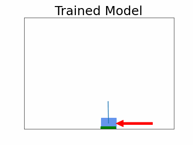

# Optimize systems using historic data and machine learning

This code sample shows how to train an optimized control policy from historic data using the [Conservative Q Learning](https://sites.google.com/view/cql-offline-rl) (CQL) reinforcement learning method.

CQL finds optimized actions based on data you already have, and conservativly estimates it's performance after taking that action.

You can compare CQL's performance estimate with historic system performance for an indication of if CQL will perform better than the existing control system.


## Architecture


## Example simulated training data and trained model episodes
 

The historic data was generated using 50% expert actions and 50% random actions.


## Steps to use this project
1. Deploy the template using the [Serverless Application Module](https://aws.amazon.com/serverless/sam/). Use the command `sam build --use-container` followed by `sam deploy --guided` from this project's root directory.
2. Generate mock historic data by running the 'generate_mock_data.sh' script: `sh ./assets/generate_mock_data.sh`. This script runs a simulation 2000 times using an AWS Lambda function. The results of those simulation runs are put into a Kinesis Firehose which delivers the data to S3. The template contains a glue table for this data, which allows the AWS Glue ETL job to process the data.
3. You can now view the measurement data using Amazon Athena. Look for the Glue database named `<CloudFormation stack name>_historian_db`.
4. Run the AWS Glue ETL job named `JsonToRllibFormatGlueJob`. You can find it in the AWS console by navigating to the AWS Glue ETL job page, and locating the job named `<CloudFormation stack name>-JsonToRllibFormatJob`.
5. Now the S3 bucket `<CloudFormation stack name>-databucket-<uniquie id>` will have a `ray_offline_data` prefix with the pre-processed data files. These data files contain json objects with information about each time step's observtions (measurement values), actions, and rewards.
6. Train a ML model by invoking the lambda function named `<CloudFormation stack name>-TuningJobLauncherFunction-<uniquie id>`.
7. View the results of the tuning jobs in Sagemaker Studio. Select a tuning run based on criteria in [this paper](https://arxiv.org/abs/2109.10813). Look for a training run where the `critic_loss` stays low and the `mean_q` is high.
8. Find the "S3 model artifact" for the favored training job. Supply it to the Lambda function named `<CloudFormation stack name>-ModelDeployerFunction-<uniquie id>`. This will create a serverless SageMaker endpoint to serve the trained model.
9. Now call the Lambda function named `<CloudFormation stack name>-RunPhysicsSimulationFunction-<uniquie id>` with the endpoint name in the event. This will run the physic simulation using the model you just trained.
10. The results of this Lambda invocation will also be stored in the S3 bucket `<CloudFormation stack name>-databucket-<uniquie id>`. You can compare the performance of the trained model with the performance in the training data using the sample Athena query below.


### Sample Athena Query
```
WITH 
    sum_reward_by_episode AS (
        SELECT SUM(reward) as sum_reward, COUNT(1) as timesteps, m_temp.episode_id, m_temp.action_source
        FROM "<CloudFormation stack name>_historian_db"."measurements_table" m_temp
        GROUP BY m_temp.episode_id, m_temp.action_source
        )

SELECT sre.action_source, AVG(sre.sum_reward) as avg_total_reward_per_episode, AVG(timesteps) AS avg_timesteps_per_episode, SUM(CAST(timesteps=1000 AS DOUBLE))/COUNT(1) AS p_max_time, SUM(timesteps) AS total_timesteps, COUNT(1) as total_episodes
FROM  sum_reward_by_episode sre
GROUP BY sre.action_source
ORDER BY avg_total_reward_per_episode DESC
```

## Detailed Walkthrough
This project first generates data mock historic data by running a simulation on a lambda function. The simulated environment is cart-pole, but with force control instead of the usual binary velocity control. This environment was chosen because: 1/ The observations and actions are continuous values, 2/ A gif can communicate the performance of an actor on the system, 3/ The system has an unstable equlibrium point. Code for the simulated environment is stored in a lambda layer, who's source code is stored in `functions/simulation_layer/`. When the lambda function `RunPhysicsSimulationFunction` is called, every x time steps the timestep data is put into a Kinesis Firehose which stores it in S3. The template contains a glue table `GlueMeasurementsTable` which allows the data to be queried using Athena. To generate data for the offline rl workflow, call the lambda function a number of times. The script `./assets/generate_mock_data.sh` automates the process of calling the simulation lambda funciton 2000 times. After calling the `generate_mock_data.sh` file, wait 1 minute, and then you can query the simulation timestep data using Athena. 

Companies with data lakes may already have a Glue table with measurement data. If a company has historic process data outside of a data lake, check out [AWS Lake Formation](https://aws.amazon.com/lake-formation/) to move data into a data lake.

Now that historic measurement data is stored in S3, we can use a Glue ETL job to transform the data into a format approprate for traing a reinforcement learning mode. In this sample the Ray rllib library is used. For the rllib library, you store timestep data as json objects. The object below shows an example preprocessed timestep.
```json
{"type":"SampleBatch","t":[0],"eps_id":["2023-03-30T15:05:03.594244"],"agent_index":[0],"obs":"BCJNGGhAkAAAAAAAAAB5iwAAAFKABZWFAAEA8hmMEm51bXB5LmNvcmUubnVtZXJpY5SMC19mcm9tYnVmZmVylJOUKJYQLgDxBQAluCU/DVrGu0IttrzBA7+9lIwFQADxFpSMBWR0eXBllJOUjAJmNJSJiIeUUpQoSwOMATyUTk5OSv////8FAPAFSwB0lGJLAUsEhpSMAUOUdJRSlC4AAAAA","actions":[[-0.04558326676487923]],"action_prob":[1],"action_logp":[0],"rewards":[12.524022102355957],"prev_actions":[[0]],"prev_rewards":[0],"dones":[false],"infos":[{}],"new_obs":"BCJNGGhAkAAAAAAAAAB5iwAAAFKABZWFAAEA8hmMEm51bXB5LmNvcmUubnVtZXJpY5SMC19mcm9tYnVmZmVylJOUKJYQLgDxBQB6nSU/Yq6mPIdbobzUHgK+lIwFQADxFpSMBWR0eXBllJOUjAJmNJSJiIeUUpQoSwOMATyUTk5OSv////8FAPAFSwB0lGJLAUsEhpSMAUOUdJRSlC4AAAAA","unroll_id":[1800]}
```
The obs and new_obs values are compressed. Rllib can handle images too by compressing the pixel values into a json object of this format.
The glue job named `${AWS::StackName}-JsonToRllibFormatJob` transoforms data from the glue table to into rllib format, and stores it in the S3 bucket `<CloudFormation stack name>-databucket-<uniquie id>` under the prefix `ray_offline_data`. 

Now the data is prepaired for the hyperparameter tuning job. You can launch the hyperparameter tuning job by invoking the lambda function `<CloudFormation stack name>-TuningJobLauncherFunction-<uniquie id>`.
When you launch this function, the flow below executes:
1. The lambda function creates an estimator to execute training runs.
2. The lambda function invokes a hyperparameter tuning job with this estimator. Options for which hyperparameters to tune include learning rates for the actor and critic, and model capacity for actor / critic.
3. In the entry point script, the following steps happen.
   1. A [Conservative Q Learning](https://docs.ray.io/en/latest/rllib/rllib-algorithms.html#cql) algorithm is built.
   2. Settings from the hyperparameter tuning job are applied to the algorithm.
   3. A stopper is configured to end the tuning job when the "Critic Loss" stops decreasing.
   4. The data is split into train / validation groups.
   5. The algorithm begins training. Each epoch validation loss metrics are saved.
   6. When training completes, the cql policy is exported into PyTorch format. An ONNX format policy model is also saved.
4. After each training run, SageMaker stores the trained model data in S3.
5. The tuning job continues until the maximum number of experiments has been reached.

Now that the tuning job has finished, take a look at the metrics emitted during training. You can use CloudWatch, SageMaker Studio, or the `utils/investigate_training.py` file to view these metrics. Use the methodology from [this paper](https://arxiv.org/abs/2109.10813) to chose the model to deploy. Generally speaking, look for a training job with low `td_mse` and a high `q_mean` value. Look for this job in the sagemaker training jobs console page, and record the "S3 model artifact".

Now call the lambda function `<CloudFormation stack name>-ModelDeployerFunction-<uniquie id>` with an event of this form:

```json
{
  "DescribeTrainingJob": {
    "ModelArtifacts": {
      "S3ModelArtifacts": "s3://<CloudFormation stack name>-assetsbucket-ngagfxwcupoc/training/offline-rl-2000-iter-230414-1622-010-ef16bf2e/output/model.tar.gz"
    }
  }
}
```
This will deploy the trained model to a serverless SageMaker endpoint. You can get acton recommendations from this endpoint by sending a message body of the form:
```json
{"inputs": ["Measurement1", "Measurement2", "..."]}
```

To test trained model, call the `RunPhysicsSimulationFunction` lambda function with an event of the form:
```json
{"random_action_fraction": 0.0, "inference_endpoint_name": "<sagemaker inference endpoint name>"}
```
This will run the simulation, using the new trained model as the action recommender. The results of this sumulation will be stored in S3 along with the data generated earlier.

You can view the performance of the new model by using Athena. Try the "Sample Athena Query" above to see performance metrics for each action source. One action source will be called `LQR_epsilon=0.5` and the other will be called `<sagemaker inference endpoint name>_epsilon=0.0`. The LQR action source was used to generate the training data. It uses a Linear Quadratic Regulator to find the optimal aciton, but actions randomly 50% of the time.

## Usage Guidance
The sample code; software libraries; command line tools; proofs of concept; templates; or other related technology (including any of the foregoing that are provided by our personnel) is provided to you as AWS Content under the AWS Customer Agreement, or the relevant written agreement between you and AWS (whichever applies). You should not use this AWS Content in your production accounts, or on production or other critical data. You are responsible for testing, securing, and optimizing the AWS Content, such as sample code, as appropriate for production grade use based on your specific quality control practices and standards. Deploying AWS Content may incur AWS charges for creating or using AWS chargeable resources, such as running Amazon EC2 instances or using Amazon S3 storage.

## Contributing
Please create a new GitHub issue for any feature requests, bugs, or documentation improvements.

Where possible, please also submit a pull request for the change.

## Security

See [CONTRIBUTING](CONTRIBUTING.md#security-issue-notifications) for more information.

## License

This library is licensed under the MIT-0 License. See the LICENSE file.